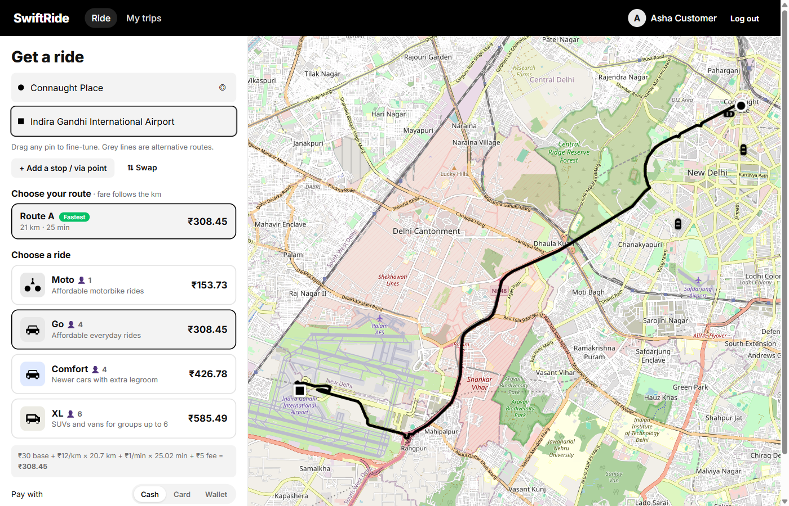
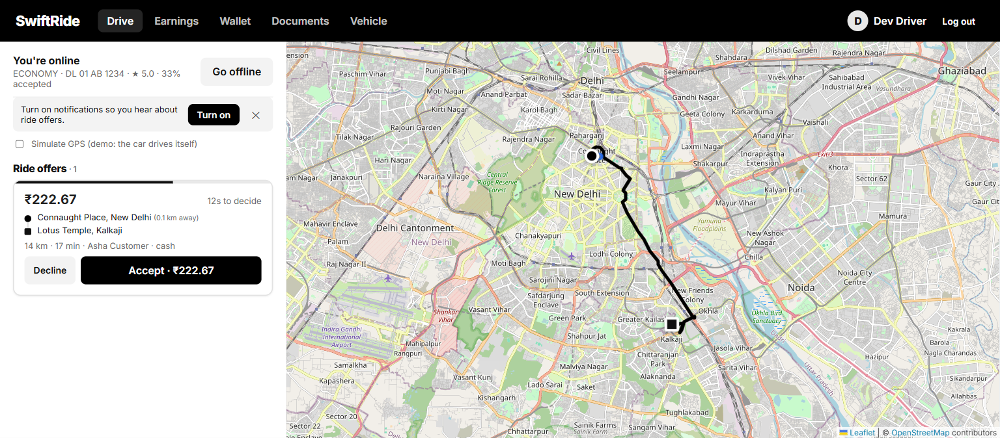
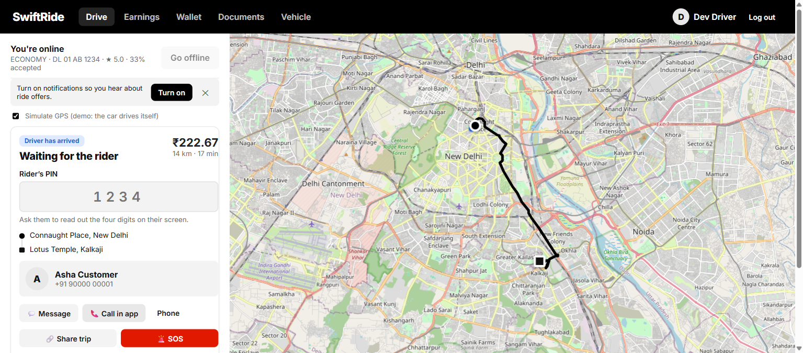
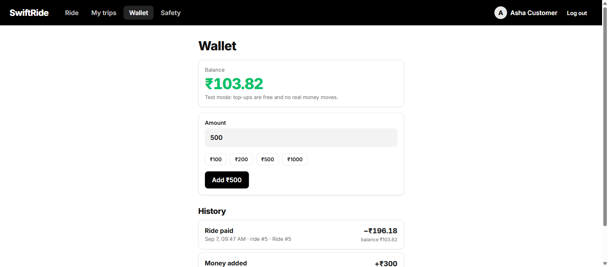
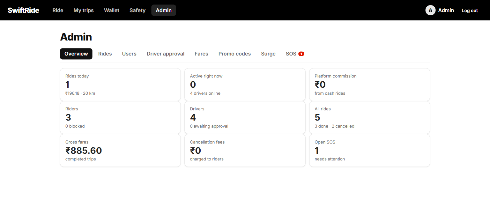
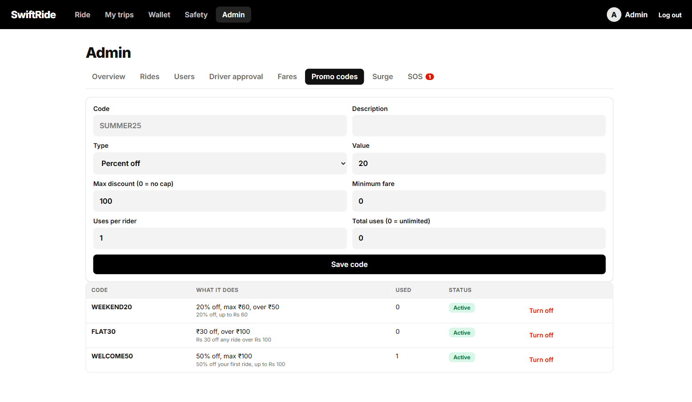
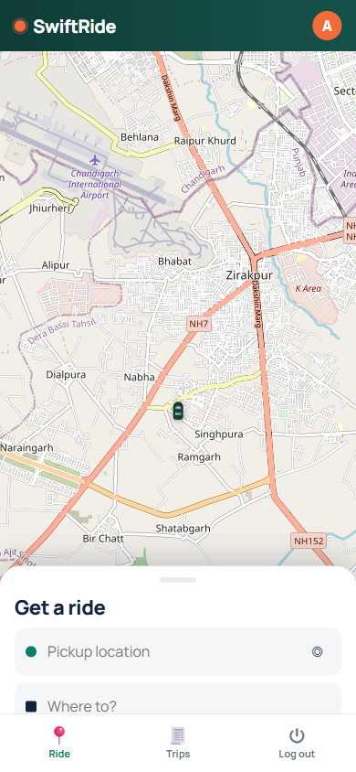
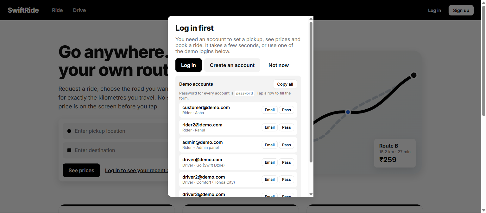

# SwiftRide

A ride-hailing app built from scratch: website, installable phone app, signed Android APK, Node API, database, realtime layer and an admin panel.

**The idea that makes it different:** the customer picks the route. Alternatives, custom via points, draggable pins. The fare is then computed from the kilometres of *that* route, and the whole sum is printed on the screen before you tap.

<p align="center">
  
</p>

---

## Contents

- [Screens](#screens)
- [What it does](#what-it-does)
- [Run it](#run-it)
- [Demo accounts](#demo-accounts)
- [Get it on a phone](#get-it-on-a-phone)
- [Tech stack](#tech-stack)
- [How the fare works](#how-the-fare-works)
- [How matching works](#how-matching-works)
- [Project layout](#project-layout)
- [Configuration](#configuration)
- [Tests](#tests)
- [Documentation](#documentation)

---

## Screens

| Booking a ride | The driver's offer |
| --- | --- |
|  |  |
| Route alternatives, stops, live fare per class | 20-second countdown, fare, distance to pickup, accept or decline |

| Trip PIN | Wallet |
| --- | --- |
|  |  |
| The driver must type the rider's 4 digits to start | Every rupee in and out, with a running balance |

| Admin dashboard | Promo codes |
| --- | --- |
|  |  |
| Live figures across the whole service | Create, cap and switch off discount codes |

| Phone layout | Login prompt |
| --- | --- |
|  |  |
| Full-screen map with a bottom sheet and tab bar | Demo credentials with one-tap copy |

More in [`docs/screenshots/`](docs/screenshots/), including the Android emulator runs.

---

## What it does

### For riders

- **Pick your own route.** Every alternative is drawn on the map. Tap one and the price changes with the kilometres.
- **Add stops.** Up to 5 via points. Tap the map and the route bends through them.
- **Drag any pin** to fine-tune the road you take.
- **Instant place suggestions.** Your recent places, popular places and 26 well-known landmarks appear before you type a single letter, then filter on every keystroke. Full address search from three letters.
- **Four vehicle classes** (Moto, Go, Comfort, XL), each with its own tariff.
- **Promo codes** with percent or flat discounts, caps, minimum fares and per-rider limits.
- **Surge pricing** you can see and understand, applied only to the distance and time parts of the fare.
- **Live tracking with a real road ETA**, recalculated as the driver moves.
- **Chat and in-app voice calls** without giving out your phone number.
- **Trip PIN** so you never get into the wrong car.
- **Share my trip** — a public link, no account needed, that shows the car moving.
- **SOS** that alerts the admin panel and offers a one-tap call to your saved contacts.
- **Wallet** with a full plus and minus history, plus cash and card options.
- **Receipts** showing exactly how the fare was reached.

### For drivers

- **Offers, not a free-for-all.** Rides come to the nearest free drivers with a countdown, so you only see trips you can actually reach.
- **Accept or decline** with the fare and distance to pickup shown up front.
- **Earnings that match the wallet**: fares, commission, cancellation fees received, penalties, take-home.
- **Document upload** for licence, RC, insurance, permit and photo, with admin approval.
- **Acceptance rate** tracked and used to break ties between equally near drivers.
- **A penalty if you cancel after accepting**, and the rider goes straight back into the search rather than being stranded.
- **Simulate GPS** so the whole flow can be demonstrated from a desktop.

### For you, running it

- **Admin panel** with eight screens: live figures, all rides, all users, driver approval, fare editing, promo codes, surge zones and SOS alerts.
- **Change fares live.** Edit a tariff and the next ride uses the new price. No restart, no deploy.
- **Block a user** in one tap.
- **Adjust any wallet** for refunds and goodwill.
- **Follow the dispatch trail** for any ride: who was offered it, who declined, who took it.

---

## Run it

```bash
git clone https://github.com/jashith123/uber_clone.git
cd uber_clone
npm run install:all     # root, server and client dependencies
npm run seed            # demo accounts (safe to re-run)
npm run serve           # builds the site, then serves everything on :4000
```

Open <http://localhost:4000>.

| Command | What it does |
| --- | --- |
| `npm run dev` | Development mode: site on 5173, API on 4000, hot reload |
| `npm run serve` | Production build: site, API and sockets all on port 4000 |
| `npm test` | 27 backend tests, no network needed |
| `npm run seed` | Create or refresh the demo accounts |
| `npm run tunnel` | Public HTTPS address for phone testing |
| `npm run push:keys` | Generate the free push-notification keys |
| `npm run android:build` | Build a signed Android APK |
| `npm run docker:up` | Run the whole thing in Docker |

---

## Demo accounts

Password for **all** of them is `password`. In the app you can copy any email or password with one tap, or copy the whole list.

| Email | Role |
| --- | --- |
| `customer@demo.com` | Rider (Asha), starts with wallet balance |
| `rider2@demo.com` | Rider (Rahul) |
| `admin@demo.com` | Rider **and** admin — use this to open `/admin` |
| `driver@demo.com` | Driver, Go class, white Swift Dzire |
| `driver2@demo.com` | Driver, Comfort class, Honda City |
| `driver3@demo.com` | Driver, XL class, Toyota Innova |
| `driver4@demo.com` | Driver, Go class, Hyundai Aura |

Promo codes to try: `WELCOME50`, `FLAT30`, `WEEKEND20`.

> **If nothing happens after you book:** a ride is only offered to a driver who is online, of the same vehicle class, and within 3 km of the pickup. Open the driver app, go online, and switch on "Simulate GPS".

---

## Get it on a phone

**Android app.** Install [`dist-apk/SwiftRide-release.apk`](dist-apk/). Phone and PC on the same Wi-Fi; the login screen already carries the PC's address. Rebuild it after code changes with `npm run android:build`.

**Installable web app.** Open the site on a phone over HTTPS (`npm run tunnel`) and choose "Install app" on Android or "Add to Home Screen" on iPhone.

**Off your Wi-Fi.** Run `npm run tunnel` and paste the printed `https://…` address into the app's server field.

Full instructions, including notifications and the microphone, are in [docs/TESTING_GUIDE.md](docs/TESTING_GUIDE.md).

---

## Tech stack

| Layer | Choice | Why |
| --- | --- | --- |
| **Frontend** | React 18, TypeScript, Vite 6 | Fast dev loop, type safety, tiny production bundle |
| **Routing (UI)** | React Router 6 | Standard SPA routing |
| **Maps** | Leaflet + react-leaflet, OpenStreetMap tiles | Free, no API key, no vendor lock-in |
| **Road routing** | OSRM (proxied through the API) | Free road routes with real alternatives and via points |
| **Geocoding** | Nominatim (proxied through the API) | Free address search and reverse geocoding |
| **Backend** | Node.js 24, Express 4 | Same language as the frontend, no build step |
| **Realtime** | Socket.IO 4 | Ride offers, live tracking, chat, call signalling |
| **Database** | SQLite via Node's built-in `node:sqlite` | Zero install, single file, swappable for Postgres |
| **Auth** | JSON Web Tokens + bcrypt | Stateless, 90-day sessions, works for web and native |
| **Payments** | Razorpay REST (plus a built-in mock gateway) | No SDK dependency; mock lets you test for free |
| **Push** | Web Push with VAPID (`web-push`) | Free forever, no Firebase account needed |
| **Voice calls** | WebRTC with public STUN | Direct phone-to-phone audio, no per-minute cost |
| **File uploads** | Multer, stored on disk | Driver documents |
| **Native app** | Capacitor 7 → Android (Gradle, Java 21) | Wraps the same code into a signed APK |
| **PWA** | Hand-written service worker + manifest | Offline shell, installable, receives push |
| **Tests** | Node's built-in test runner | 27 tests, no extra framework, no network |
| **Container** | Docker + docker-compose | One command to run anywhere |

No paid service is required to run any of it. The only optional paid pieces are a real payment gateway, SMS verification and app-store distribution.

---

## How the fare works

```
distance_charge = per_km  × km   × surge
time_charge     = per_min × min  × surge
subtotal        = base_fare + distance_charge + time_charge + booking_fee
total           = max(subtotal, min_fare) − promo_discount
```

Surge never touches the base fare or the booking fee. The discount is applied *after* the minimum-fare floor, so a promo can legitimately take a fare below the minimum.

| Class | Base | Per km | Per min | Minimum | Booking | Late cancel |
| --- | --- | --- | --- | --- | --- | --- |
| Moto | ₹15 | ₹6 | ₹0.50 | ₹25 | ₹2 | ₹10 |
| Go | ₹30 | ₹12 | ₹1 | ₹50 | ₹5 | ₹30 |
| Comfort | ₹50 | ₹16 | ₹1.50 | ₹80 | ₹8 | ₹40 |
| XL | ₹70 | ₹22 | ₹2 | ₹120 | ₹10 | ₹50 |

These are placeholders. Change them in the admin panel under **Fares** and the next ride uses the new numbers.

**The client never sets the price.** It sends only the waypoints and which alternative was chosen; the server re-requests the route, measures it and computes the fare from the tariff table. A tampered client cannot lower the fare.

---

## How matching works

```
new ride
   │
   ├─ wave 1  → 3 nearest free drivers within 3 km, 20s each
   │              ├─ someone accepts → every other offer is closed
   │              └─ all decline / time out ↓
   ├─ wave 2  → within 6 km, drivers not already asked
   ├─ wave 3  → within 10 km
   └─ nobody  → the rider is told no drivers are free
```

Accepting is a single conditional `UPDATE`, so two drivers tapping at the same instant cannot both win. Ties between equally near drivers are broken by acceptance rate. If the server restarts mid-search, dispatch resumes on boot.

**Cancellation policy.** Free while still searching, and free for 2 minutes after a driver accepts. After that, or once the driver has arrived, the rider pays the class cancellation fee and the driver receives it. A driver who cancels after accepting loses ₹20 and the rider goes back into the queue.

---

## Project layout

```
uber_clone/
├── server/
│   ├── src/
│   │   ├── index.js app.js config.js db.js schema.sql auth.js realtime.js seed.js
│   │   ├── routes/    auth geo rides drivers payments safety push admin
│   │   └── services/  fare dispatch payments promos surge places geo rides drivers chat safety push
│   ├── test/          fare.test.js  rides.test.js  money.test.js
│   └── scripts/       gen-vapid.mjs
├── client/
│   ├── src/
│   │   ├── lib/         api auth socket push geo format types brand
│   │   ├── components/  MapView PlaceSearch RideStatusCard Comms TopNav BottomTabs DemoAccounts
│   │   └── pages/       Landing Login Signup Wallet Safety Admin TrackTrip
│   │       ├── customer/  RideHome Trips
│   │       └── driver/    DriverHome DriverEarnings DriverVehicle DriverDocuments
│   ├── android/       Capacitor Android project
│   ├── public/        manifest, service worker, icons
│   └── scripts/       build-android.mjs, make-icons.mjs, make-android-icons.mjs
├── docs/              BUILD_REPORT.md  TESTING_GUIDE.md  report.html  screenshots/
├── dist-apk/          the built Android app
├── Dockerfile  docker-compose.yml
└── package.json
```

---

## Configuration

Copy `server/.env.example` to `server/.env`. Everything has a working default, so the file is optional.

| Setting | Default | What it changes |
| --- | --- | --- |
| `PAYMENT_PROVIDER` | `mock` | `razorpay` for real cards and UPI |
| `RAZORPAY_KEY_ID` / `_SECRET` | empty | Your gateway keys |
| `COMMISSION_PERCENT` | `15` | Your cut of each fare |
| `DISPATCH_OFFER_SECONDS` | `20` | How long a driver has to accept |
| `DISPATCH_RADII_KM` | `3,6,10` | The search rings |
| `REQUIRE_DRIVER_APPROVAL` | `0` | `1` makes new drivers wait for admin approval |
| `ADMIN_EMAILS` | `admin@demo.com` | Accounts that get the admin panel |
| `VAPID_PUBLIC_KEY` / `_PRIVATE_KEY` | empty | Push notifications (`npm run push:keys` writes them) |
| `OSRM_URL` / `NOMINATIM_URL` | public servers | Point at your own for production |

---

## Tests

```bash
npm test
```

27 tests, no network required:

- **Fares** — the formula, minimum-fare floor, surge applied only to distance and time, discount after the floor, negative and NaN inputs clamped.
- **Money** — wallet ledger and running balance, overdraft refused, wallet ride pays the driver net of commission, cash ride takes only commission.
- **Promos** — percent codes capped, per-rider limits, minimum fares, unknown codes rejected.
- **Dispatch** — offers only reach the nearest free driver, an unoffered ride cannot be accepted, declining retires the offer, accepting closes every other one.
- **Ride lifecycle** — the full happy path, PIN required and hidden from the driver, double-accept refused, illegal transitions refused, strangers refused, the cancellation-fee matrix, driver penalty and re-queue.

---

## Documentation

| Document | What's in it |
| --- | --- |
| **[docs/report.html](docs/report.html)** | Status report in plain words: what works, what doesn't, what's free, what costs money, what's needed from you. Open it in a browser. |
| [docs/BUILD_REPORT.md](docs/BUILD_REPORT.md) | The technical build log: decisions, API reference, database schema, every phase |
| [docs/TESTING_GUIDE.md](docs/TESTING_GUIDE.md) | Step-by-step testing on phones, with a checklist for every feature |

---

## Status and honesty

This is a working prototype, not a launched product.

- Fares are **placeholders**, not researched prices.
- Payments run through a **mock gateway** until you add real keys.
- There is **no phone verification** yet, so sign-ups are unverified.
- Routing and geocoding use **free public servers** that are rate-limited and ask you not to use them heavily.
- The Android app is signed with a **development key**, not a Play Store key.
- In-app calls connect on Wi-Fi and most home networks; **across two mobile networks** they may need a relay server.

Everything above is tracked with effort estimates in [docs/report.html](docs/report.html).

---

Maps © OpenStreetMap contributors. A study project.
