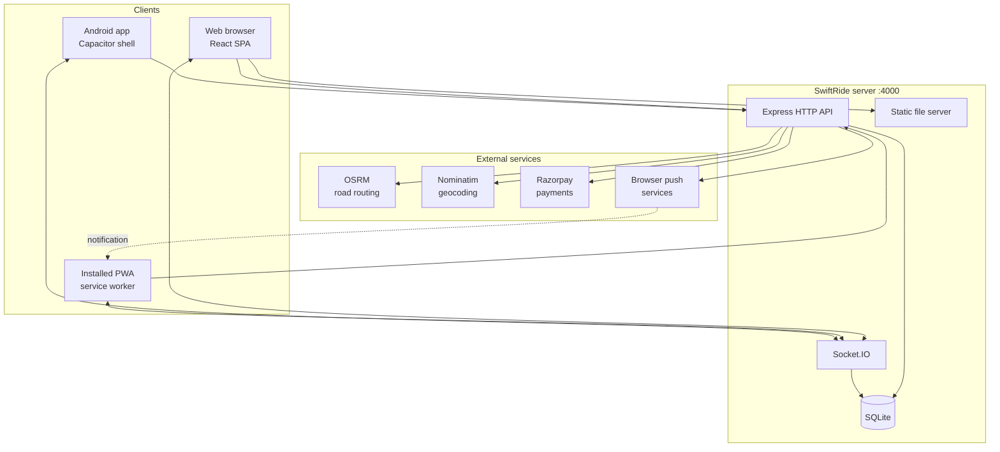
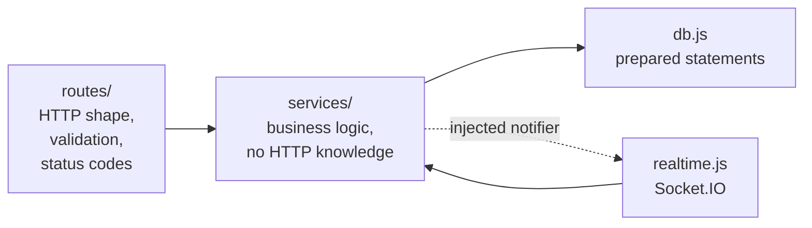
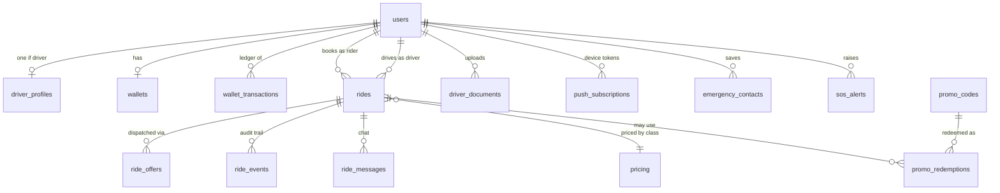
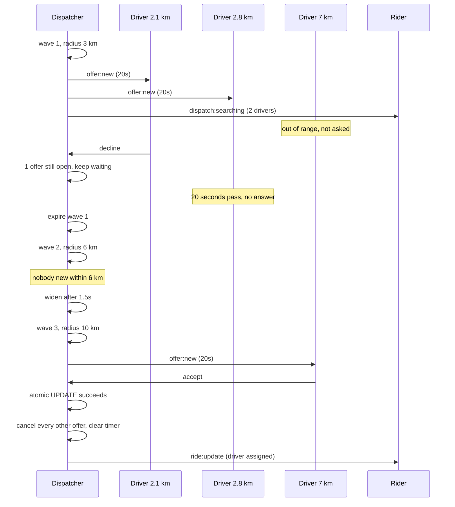
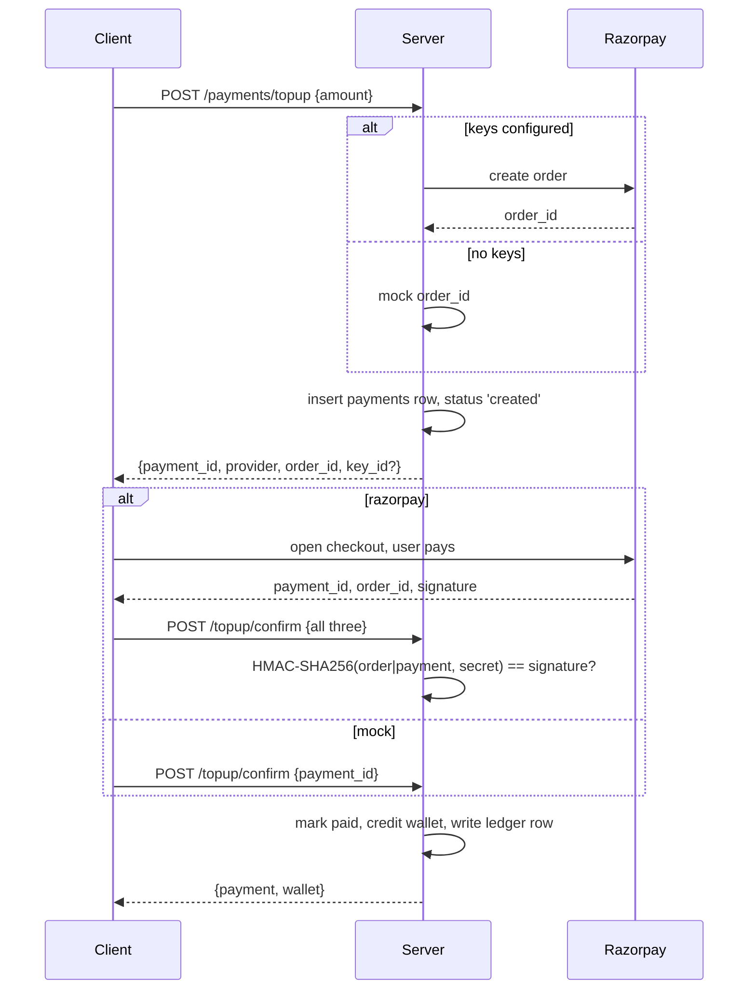
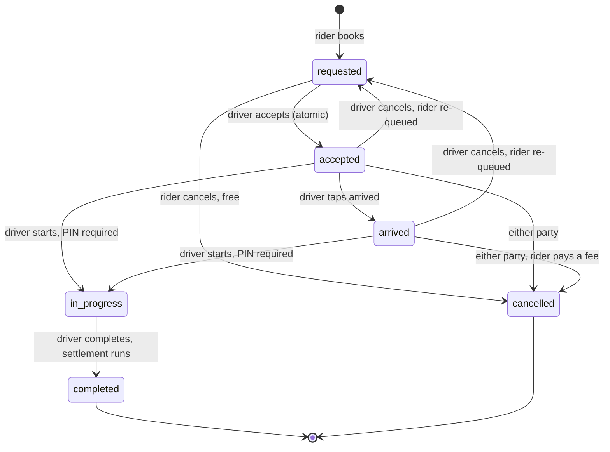
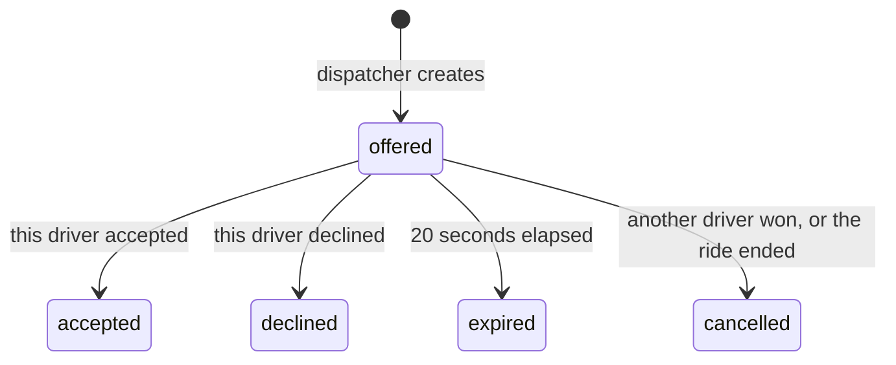
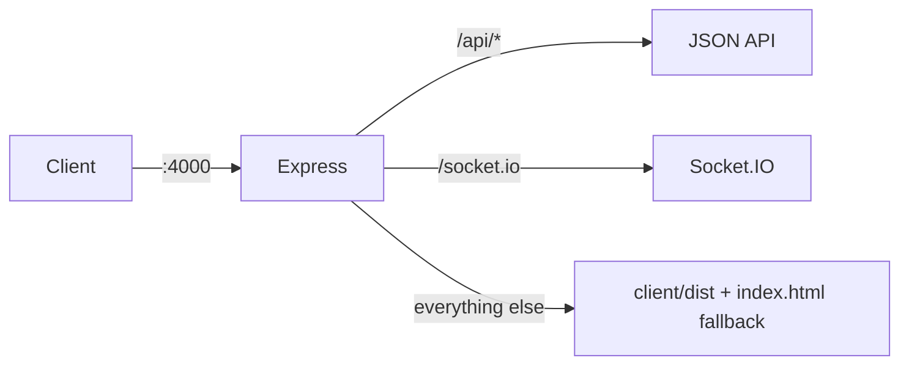

# SwiftRide — Low Level Design

| | |
| --- | --- |
| **Version** | 0.3 |
| **Date** | 7 September 2026 |
| **Covers** | Architecture, data model, API, algorithms, realtime, security |
| **Companion** | [PRD.md](PRD.md) for what and why; this document is how |

---

## Contents

1. [Architecture](#1-architecture)
2. [Technology choices](#2-technology-choices)
3. [Data model](#3-data-model)
4. [Module structure](#4-module-structure)
5. [API reference](#5-api-reference)
6. [Realtime events](#6-realtime-events)
7. [Core algorithms](#7-core-algorithms)
8. [Sequence flows](#8-sequence-flows)
9. [State machines](#9-state-machines)
10. [Security](#10-security)
11. [Error handling](#11-error-handling)
12. [Performance notes](#12-performance-notes)
13. [Deployment](#13-deployment)
14. [Testing](#14-testing)
15. [Known limitations](#15-known-limitations)

---

## 1. Architecture

### 1.1 System context



One process serves everything: the built web app, the JSON API, and the WebSocket. That means one port, one address, one tunnel, one container.

### 1.2 Layers



**The rule that keeps this testable:** services never import `realtime.js`. Instead each service exposes a `setXNotifier(fn)` and `realtime.js` injects a function that emits sockets. In tests the notifier is a no-op, so the whole ride lifecycle runs without a server.

```js
// services/rides.js
let notify = () => {};
export function setNotifier(fn) { notify = fn; }
// ... later
notify('ride:update', payload);
```

### 1.3 Why one process and one file database

| Decision | Reason | What changes at scale |
| --- | --- | --- |
| Single Node process | No orchestration, no service discovery, trivial to run and to tunnel | Split the socket layer out and use a Redis adapter |
| SQLite | Built into Node 22+, zero install, one file to back up | Swap to Postgres; only `db.js` and a few queries change |
| In-memory dispatch timers | No queue infrastructure needed | Move to a job queue so timers survive across multiple instances |
| Static files from Express | One origin, so no CORS and no second deployment | Put a CDN in front |

---

## 2. Technology choices

| Layer | Choice | Version | Why this and not the alternative |
| --- | --- | --- | --- |
| UI | React + TypeScript | 18 / 5.6 | Types catch shape mistakes across ~30 files; alternatives add build complexity for no gain here |
| Build | Vite | 6 | Sub-second rebuilds; the production bundle is 460 kB, 141 kB gzipped |
| Routing (UI) | React Router | 6 | Standard; supports the public `/t/:token` route without auth |
| Maps | Leaflet + react-leaflet | 1.9 / 4.2 | No API key, no quota, no billing account. Google Maps would need a card on file. |
| Road routing | OSRM | public server | Returns real alternatives and supports via points, which the core feature depends on. Free to self-host later. |
| Geocoding | Nominatim | public server | Free, no key. Rate limited, hence the local suggestion layer in front of it. |
| Server | Express | 4 | Small, well understood, no framework lock-in |
| Realtime | Socket.IO | 4 | Automatic reconnect and fallback; raw WebSocket would need that written by hand |
| Database | `node:sqlite` | built in | No native compilation on Windows, which `better-sqlite3` requires |
| Auth | jsonwebtoken + bcryptjs | 9 / 2.4 | Stateless tokens work identically for web and native |
| Payments | Razorpay REST + mock | — | Called over `fetch`, so no SDK dependency; the mock lets the whole flow be tested for free |
| Push | web-push (VAPID) | 3 | Free forever with no account. Firebase would need a Google project. |
| Calls | WebRTC + public STUN | — | Direct peer audio, no per-minute cost, no media server |
| Uploads | multer | 1 | Disk storage; no object-store account needed |
| Native | Capacitor | 7 | Wraps the same web build; React Native would mean writing the UI twice |
| Tests | `node:test` | built in | No Jest, no config, no extra dependency |

---

## 3. Data model

### 3.1 Entity relationships



### 3.2 Tables

Seventeen tables. Primary keys are `INTEGER PRIMARY KEY AUTOINCREMENT` unless stated.

#### `users`
| Column | Type | Notes |
| --- | --- | --- |
| `id` | INTEGER PK | |
| `role` | TEXT | `customer` or `driver`, CHECK constrained |
| `name` | TEXT NOT NULL | |
| `email` | TEXT UNIQUE COLLATE NOCASE | Login identity |
| `phone` | TEXT | Unverified in this version |
| `password_hash` | TEXT NOT NULL | bcrypt, cost 10 |
| `is_admin` | INTEGER default 0 | Gates the admin panel |
| `is_blocked` | INTEGER default 0 | Blocks login and going online |
| `created_at` | TEXT | `datetime('now')` |

An admin is a `customer` row with `is_admin = 1`, so the same account can book rides and administer.

#### `driver_profiles`
One row per driver. `user_id` is both PK and FK.

| Column | Type | Notes |
| --- | --- | --- |
| `user_id` | INTEGER PK FK | |
| `vehicle_type` | TEXT | Must match a `pricing.vehicle_type` |
| `vehicle_make`, `vehicle_model`, `vehicle_color`, `plate` | TEXT | Shown to the rider |
| `is_online` | INTEGER | Eligible for offers |
| `lat`, `lng`, `heading` | REAL | Last known position |
| `location_at` | TEXT | When that position was recorded |
| `rating`, `rating_count` | REAL / INTEGER | Running average |
| `approval_status` | TEXT | `pending`, `approved`, `rejected` |
| `approval_note` | TEXT | Reason shown to a rejected driver |
| `approved_at` | TEXT | |
| `acceptance_rate` | REAL | Derived, 0–100 |
| `offers_seen`, `offers_taken` | INTEGER | Inputs to the rate |

#### `pricing`
The tariff table. Editable live from the admin panel; the next ride uses the new values.

| Column | Type | Notes |
| --- | --- | --- |
| `vehicle_type` | TEXT PK | `bike`, `economy`, `comfort`, `xl` |
| `label`, `description` | TEXT | Shown in the UI |
| `seats` | INTEGER | |
| `base_fare`, `per_km`, `per_min`, `min_fare`, `booking_fee`, `cancel_fee` | REAL | The formula inputs |
| `currency` | TEXT | Default `INR` |
| `sort_order` | INTEGER | Display order |

#### `rides`
The central table.

| Column | Type | Notes |
| --- | --- | --- |
| `id` | INTEGER PK | |
| `customer_id`, `driver_id` | INTEGER FK | `driver_id` null until accepted |
| `status` | TEXT | CHECK: `requested`, `accepted`, `arrived`, `in_progress`, `completed`, `cancelled` |
| `vehicle_type` | TEXT | |
| `pickup_lat/lng/address`, `dropoff_lat/lng/address` | REAL / TEXT | Denormalised for fast list queries |
| `waypoints` | TEXT | **JSON** array of `{lat,lng,address}` including pickup and drop-off |
| `route_index` | INTEGER | Which OSRM alternative the rider chose |
| `route_geometry` | TEXT | **JSON** `[[lat,lng], …]`, the drawn polyline |
| `distance_km`, `duration_min` | REAL | Of the chosen route |
| `fare_estimate`, `fare_final` | REAL | Final is set on completion |
| `fare_breakdown` | TEXT | **JSON** snapshot of the whole calculation |
| `surge_multiplier` | REAL | Applied at booking |
| `promo_code`, `discount` | TEXT / REAL | |
| `currency`, `payment_method`, `payment_status` | TEXT | `cash`/`card`/`wallet`; `pending`/`paid`/`failed` |
| `pin` | TEXT | 4 digits, never sent to the driver |
| `share_token` | TEXT | Public tracking link |
| `dispatch_state` | TEXT | `idle`, `searching`, `no_drivers` |
| `driver_eta_min` | REAL | Live minutes to pickup |
| `cancel_reason`, `cancelled_by`, `cancel_fee`, `driver_penalty` | TEXT / REAL | |
| `customer_rating`, `driver_rating` | INTEGER | 1–5, one each way |
| `created_at`, `accepted_at`, `arrived_at`, `started_at`, `completed_at`, `cancelled_at` | TEXT | Full timeline |

Indexes: `(customer_id, created_at DESC)`, `(driver_id, created_at DESC)`, `(status)`.

**Why JSON in three columns.** `waypoints`, `route_geometry` and `fare_breakdown` are read and written whole, never queried by their contents. A polyline is often 400+ points; normalising it into a table would cost a join returning hundreds of rows per ride for no benefit.

#### `ride_offers`
One row per driver per offer. This is the audit trail of dispatch.

| Column | Type | Notes |
| --- | --- | --- |
| `id` | INTEGER PK | |
| `ride_id`, `driver_id` | INTEGER FK | |
| `wave` | INTEGER | 1, 2 or 3 |
| `distance_km` | REAL | Driver to pickup at offer time |
| `status` | TEXT | `offered`, `accepted`, `declined`, `expired`, `cancelled` |
| `expires_at` | TEXT | Set with `datetime('now', '+N seconds')` |
| `created_at`, `responded_at` | TEXT | |

#### `wallets` and `wallet_transactions`

`wallets`: `user_id` PK, `balance` REAL, `currency`, `updated_at`.

`wallet_transactions` is append-only and is **the source of truth for all money**:

| Column | Type | Notes |
| --- | --- | --- |
| `id` | INTEGER PK | |
| `user_id` | INTEGER FK | |
| `amount` | REAL | **Signed.** Positive into the wallet, negative out |
| `balance_after` | REAL | Snapshot, so history never needs recomputation |
| `type` | TEXT | `topup`, `ride_fare`, `ride_earning`, `commission`, `cancel_fee`, `cancel_penalty`, `payout`, `refund`, `adjustment` |
| `ride_id` | INTEGER FK | Null for top-ups and payouts |
| `note` | TEXT | Human-readable reason |
| `created_at` | TEXT | |

The driver's earnings screen reads this table, not the rides table. That is why the two can never disagree.

#### `payments`
Gateway attempts: `user_id`, `ride_id`, `purpose`, `provider` (`mock`/`razorpay`), `provider_order_id`, `provider_payment_id`, `amount`, `currency`, `status` (`created`/`paid`/`failed`/`refunded`), timestamps.

#### `promo_codes` and `promo_redemptions`

`promo_codes`: `code` PK COLLATE NOCASE, `description`, `kind` (`percent`/`flat`), `value`, `max_discount` (0 = uncapped), `min_fare`, `per_user_limit`, `total_limit` (0 = unlimited), `used_count`, `active`, `expires_at`.

`promo_redemptions`: `code`, `user_id`, `ride_id`, `discount`, `created_at`. Enforces the per-user limit.

#### Remaining tables

| Table | Purpose | Key columns |
| --- | --- | --- |
| `ride_events` | Append-only audit of every ride action | `ride_id`, `actor_id`, `type`, `payload` (JSON) |
| `ride_messages` | In-ride chat | `ride_id`, `sender_id`, `body` |
| `driver_documents` | Onboarding paperwork | `driver_id`, `kind`, `file_path`, `number`, `expires_on`, `status`, `reviewer_id` |
| `push_subscriptions` | One row per browser or installed app | `user_id`, `endpoint` UNIQUE, `p256dh`, `auth` |
| `sos_alerts` | Emergency presses | `ride_id`, `user_id`, `role`, `lat`, `lng`, `status`, `handled_by` |
| `emergency_contacts` | Up to 5 per rider | `user_id`, `name`, `phone` |
| `surge_zones` | Operator-defined demand areas | `name`, `lat`, `lng`, `radius_km`, `multiplier`, `active` |

### 3.3 Migrations

`db.js` runs `schema.sql` (all `CREATE TABLE IF NOT EXISTS`) then an additive migration pass:

```js
const ensureColumn = (table, column, definition) => {
  const cols = db.prepare(`PRAGMA table_info(${table})`).all().map(c => c.name);
  if (!cols.includes(column)) db.exec(`ALTER TABLE ${table} ADD COLUMN ${column} ${definition}`);
};
```

Nineteen columns were added this way across versions. Existing databases upgrade in place on the next start with no manual step. Backfills that need values (share tokens, PINs) run in the same pass.

---

## 4. Module structure

```
server/src/
├── index.js          boot: create app, attach sockets, resume dispatch
├── app.js            Express wiring, route mounting, SPA fallback, error handler
├── config.js         all env parsing in one place, with defaults
├── db.js             open, schema, migrations, tariff and promo seeding
├── schema.sql        DDL
├── auth.js           hashing, JWT, requireAuth, requireRole, loadUser
├── realtime.js       Socket.IO: rooms, auth, notifier wiring, push triggers
├── seed.js           demo accounts
├── routes/           HTTP only: parse, validate, call a service, set a status
│   ├── auth.js       register, login, me (with silent token renewal)
│   ├── geo.js        pricing, promos, suggest, geocode, reverse, routes+quotes
│   ├── rides.js      the ride lifecycle and chat
│   ├── drivers.js    profile, online status, location, earnings, documents
│   ├── payments.js   wallet, top-up, payout, gateway config
│   ├── safety.js     public trip, contacts, SOS
│   ├── push.js       VAPID key, subscribe, test
│   └── admin.js      everything behind is_admin
└── services/         business logic, no HTTP, no sockets
    ├── fare.js       the pricing formula
    ├── surge.js      zone and live-demand multiplier
    ├── promos.js     validation and redemption
    ├── dispatch.js   the wave engine and its timers
    ├── rides.js      lifecycle, serialisation, state machine
    ├── drivers.js    location writes and ETA calculation
    ├── payments.js   wallet, ledger, gateways, settlement
    ├── places.js     suggestion ranking
    ├── geo.js        OSRM and Nominatim clients with caching
    ├── chat.js       messages
    ├── safety.js     PIN, share token, SOS
    └── push.js       web push send and subscription pruning
```

Client:

```
client/src/
├── lib/         api (fetch + base resolution), auth (context), socket,
│                push, geo (haversine, bearing), format (money, signed), types
├── components/  MapView, PlaceSearch, RideStatusCard, Comms, TopNav,
│                BottomTabs, DemoAccounts
└── pages/       Landing, Login, Signup, Wallet, Safety, Admin, TrackTrip
    ├── customer/  RideHome, Trips
    └── driver/    DriverHome, DriverEarnings, DriverVehicle, DriverDocuments
```

---

## 5. API reference

Base path `/api`. All responses are JSON. Authenticated routes take `Authorization: Bearer <jwt>`.

### 5.1 Auth

| Method | Path | Auth | Body / query | Returns |
| --- | --- | --- | --- | --- |
| POST | `/auth/register` | — | `{name, email, phone?, password, role, vehicle?}` | `{token, user}` |
| POST | `/auth/login` | — | `{email, password, role?}` | `{token, user}` |
| GET | `/auth/me` | any | — | `{user, token?}` — a fresh token once a day |

`role` in login is enforced: rider credentials with `role: "driver"` return 403 with an explanatory message.

### 5.2 Geo and pricing

| Method | Path | Auth | Purpose |
| --- | --- | --- | --- |
| GET | `/geo/pricing` | — | The tariff table |
| GET | `/geo/promos` | any | Active promo codes to show as chips |
| GET | `/geo/suggest?q=` | any | Ranked suggestions; works with an empty `q` |
| GET | `/geo/geocode?q=&lat=&lng=` | any | Address search, biased near a point |
| GET | `/geo/reverse?lat=&lng=` | any | Coordinates to an address |
| POST | `/geo/routes` | any | `{waypoints[2..8], promo_code?}` → routes, each with a quote per class, plus surge and promo validity |

### 5.3 Rides

| Method | Path | Auth | Purpose |
| --- | --- | --- | --- |
| GET | `/rides` | any | My history |
| GET | `/rides/active` | any | My current ride, if any |
| GET | `/rides/available` | driver | **Offers made to me**, not all open requests |
| POST | `/rides` | customer | `{waypoints, route_index, vehicle_type, payment_method, promo_code?}` |
| GET | `/rides/:id` | party or offered driver | Ride plus its event log |
| POST | `/rides/:id/accept` | driver | Requires an open offer |
| POST | `/rides/:id/decline` | driver | Retires the offer, may widen the search |
| POST | `/rides/:id/arrived` | driver | |
| POST | `/rides/:id/start` | driver | **Requires `{pin}`** |
| POST | `/rides/:id/complete` | driver | Triggers settlement |
| POST | `/rides/:id/cancel` | party | `{reason?}` |
| POST | `/rides/:id/rate` | party | `{stars: 1..5}` |
| GET/POST | `/rides/:id/messages` | party | Chat |

### 5.4 Drivers

| Method | Path | Purpose |
| --- | --- | --- |
| PUT | `/drivers/me` | Vehicle details |
| POST | `/drivers/me/status` | Go online or offline; refused unless approved |
| POST | `/drivers/me/location` | Position, also available over the socket |
| GET | `/drivers/me/earnings` | Ledger-derived totals plus balance |
| GET/POST | `/drivers/me/documents` | List and upload (multipart) |
| GET | `/drivers/me/documents/:id/file` | Download own document |
| GET | `/drivers/nearby?lat=&lng=` | Any signed-in user; powers the "cars nearby" layer |

### 5.5 Payments, safety, push

| Method | Path | Purpose |
| --- | --- | --- |
| GET | `/payments/config` | Which gateway is live |
| GET | `/payments/wallet` | Balance and transactions |
| POST | `/payments/topup` | Create an order |
| POST | `/payments/topup/confirm` | Verify and credit |
| POST | `/payments/payout` | Driver withdrawal |
| GET | `/safety/trip/:token` | **Public, no auth.** Sanitised trip view |
| GET/POST/DELETE | `/safety/contacts` | Emergency contacts |
| POST | `/safety/sos` | Raise an alert |
| GET | `/push/config` | VAPID public key |
| POST | `/push/subscribe` | Register a device |
| POST | `/push/test` | Send a test notification |

### 5.6 Admin

All require `is_admin = 1`.

`/admin/stats`, `/admin/rides`, `/admin/rides/:id/offers`, `/admin/users`, `/admin/users/:id/block`, `/admin/users/:id/credit`, `/admin/drivers/pending`, `/admin/drivers/:id/approval`, `/admin/documents/:id/review`, `/admin/pricing` (GET, PUT), `/admin/promos` (GET, POST, DELETE), `/admin/surge` (GET, POST, DELETE), `/admin/sos` (GET), `/admin/sos/:id/resolve`.

---

## 6. Realtime events

### 6.1 Rooms

| Room | Members | Used for |
| --- | --- | --- |
| `user:<id>` | Every socket of that user | Personal events |
| `drivers:<vehicle_type>` | Online drivers of that class | Class-wide broadcasts |
| `admins` | Users with `is_admin` | SOS and ride monitoring |

The socket handshake carries the JWT in `auth.token`. An invalid token is rejected at the middleware, so no unauthenticated socket ever joins a room.

### 6.2 Server to client

| Event | To | Payload |
| --- | --- | --- |
| `ride:created` | rider | The new ride |
| `ride:update` | rider and driver | Their own serialised view of the ride |
| `offer:new` | one driver | `{ride_id, wave, expires_in, distance_km}` |
| `offer:expired` | one driver | `{ride_id}` |
| `offer:closed` | all | `{ride_id}` |
| `dispatch:searching` | rider | `{wave, offered_to}` |
| `dispatch:none` | rider | `{ride_id}` |
| `driver:location` | rider | `{lat, lng, heading, eta_min, distance_km}` |
| `chat:message` | both parties | The message |
| `call:signal` | the other party | WebRTC offer, answer, ICE, end, reject, busy |
| `sos:new` | admins | The alert |
| `admin:ride` | admins | `{id, status}` |

**Each side receives its own serialisation.** `serializeRide(row, viewerId)` nulls the PIN for anyone who is not the rider, so the driver's socket payload physically cannot contain it.

### 6.3 Client to server

| Event | From | Payload |
| --- | --- | --- |
| `driver:location` | driver | `{lat, lng, heading}` |
| `driver:rejoin` | driver | none; re-joins the class room after a vehicle change |
| `call:signal` | party | `{ride_id, type, payload}`, relayed only between the two parties of an active ride |

---

## 7. Core algorithms

### 7.1 Fare calculation

`services/fare.js`

```js
distance_charge = round2(per_km  × km  × surge)
time_charge     = round2(per_min × min × surge)
subtotal        = round2(base_fare + distance_charge + time_charge + booking_fee)
before_discount = round2(max(subtotal, min_fare))
discount        = round2(min(wanted_discount, before_discount))
total           = round2(before_discount − discount)
```

Three deliberate decisions:

1. **Surge multiplies only distance and time.** A fixed booking fee that surges is indefensible to a rider.
2. **The minimum-fare floor is applied before the discount**, so a promo can take a fare below the minimum. Applying it after would silently void small-value promos.
3. **Every intermediate is rounded to 2 decimals**, so the printed breakdown always adds up exactly. Rounding only at the end produces receipts where the lines do not sum to the total.

Inputs are clamped: negative or `NaN` distance and duration become 0, and surge is floored at 1.

### 7.2 Surge

`services/surge.js`

```
multiplier = 1

for each active zone:
    if haversine(pickup, zone.centre) <= zone.radius_km:
        multiplier = max(multiplier, zone.multiplier)

waiting = requested rides of this class within 5 km of pickup
cars    = online drivers of this class within 5 km of pickup

if waiting >= 2 and waiting > cars:
    live = 1 + min(1.5, (waiting − cars) × 0.2)
    multiplier = max(multiplier, live)

return round1(min(multiplier, 2.5))
```

The rider is always given the reason string, for example `"3 riders waiting, 1 car nearby"`.

### 7.3 Dispatch

`services/dispatch.js`

```
startDispatch(rideId, wave = 1):
    clear any timer for this ride
    if ride is not 'requested': return
    if wave > MAX_WAVES:
        dispatch_state = 'no_drivers'
        notify rider
        return

    radius = RADII[wave - 1]                      # 3, 6, 10 km
    candidates = drivers WHERE
          is_online
      AND approval_status = 'approved'
      AND NOT is_blocked
      AND vehicle_type matches
      AND not on an active ride
      AND not already offered or declined THIS ride
      AND not holding an open offer for ANY ride
    filter to haversine(pickup, driver) <= radius
    sort by distance, then by acceptance_rate descending
    take DRIVERS_PER_WAVE (3)

    if candidates is empty:
        schedule startDispatch(rideId, wave + 1) in 1.5s      # widen at once
        return

    for each candidate:
        insert ride_offers row with expires_at = now + 20s
        increment offers_seen, recompute acceptance_rate
        emit offer:new and send a push notification

    schedule in 20.5s:
        mark all still-'offered' rows for this ride as 'expired'
        startDispatch(rideId, wave + 1)
```

Design points:

- **Empty ring widens in 1.5 s, not 20 s.** Waiting out a timer when there is provably nobody to answer wastes the rider's time.
- **A driver holding an open offer for any ride is excluded**, so nobody is asked two questions at once.
- **Declining triggers an immediate widen** if it empties the wave, rather than waiting for the timeout.
- **Timers are in memory.** `resumePendingDispatch()` runs on boot, expires stale offers and restarts wave 1 for anything still `searching`.

### 7.4 Race-free acceptance

Two drivers can tap Accept in the same millisecond. The guard is a single conditional UPDATE, which SQLite executes atomically:

```sql
UPDATE rides
   SET driver_id = ?, status = 'accepted', accepted_at = datetime('now')
 WHERE id = ? AND status = 'requested';
```

`changes === 0` means somebody else won, and that driver gets a 409 with "Ride was already taken". No transaction, no lock, no read-then-write window. This is covered by a test.

### 7.5 Place suggestion ranking

`services/places.js`

Three sources are merged, deduplicated by both position (rounded to ~100 m) and normalised name:

1. `recent` — this user's own pickups and drop-offs, most used first
2. `popular` — everyone's, most used first
3. `common` — 26 seeded Delhi NCR landmarks

Matching requires **every** word of the query to appear in the name or address, after normalising to lowercase and stripping punctuation and accents. Ranking is:

```
rank 0: the name starts with the first query word
rank 1: some word of the name starts with it
rank 2: it appears anywhere
then:   recent before popular before common
then:   more used first
```

This runs on the server against in-memory data, so a single character narrows the list without a round trip to Nominatim. The full address search is merged in below from three characters.

### 7.6 Driver ETA

`services/drivers.js`

A road ETA needs a routing call, which is far too heavy for every GPS ping. So:

- **Every ping:** a straight-line estimate, `haversine × 1.35 ÷ 22 km/h`, pushed to the rider immediately.
- **At most every 25 seconds per ride, and only under 40 km:** a real OSRM call, whose answer overwrites the estimate and is stored on the ride.

The 1.35 factor accounts for roads being longer than the crow flies; 22 km/h is a plausible city average. Both are constants that a real deployment would tune from its own data.

### 7.7 Settlement

`services/payments.js`

```
total      = fare_final
commission = total × COMMISSION_PERCENT / 100
driverShare = total − commission

if payment_method == 'wallet':
    debit  rider  total        (refuses to overdraw)
    credit driver driverShare
elif payment_method == 'cash':
    # rider paid the driver directly, so only the commission moves
    debit  driver commission
else:  # card
    credit driver driverShare

mark ride payment_status = 'paid'
```

If the wallet debit fails for lack of funds the trip still completes; the ride is marked `payment_status = 'failed'` and a `settle_failed` event is written. Blocking trip completion on a payment problem would strand both people at the roadside.

---

## 8. Sequence flows

### 8.1 Booking to completion

```mermaid
sequenceDiagram
    participant R as Rider app
    participant S as Server
    participant O as OSRM
    participant D as Driver app

    R->>S: POST /geo/routes {waypoints, promo}
    S->>O: route with alternatives
    O-->>S: 3 routes
    S->>S: surge per class, promo per class, quoteAll()
    S-->>R: routes + quotes + surge + promo validity

    R->>S: POST /rides {waypoints, route_index, class, payment, promo}
    S->>O: re-request the route (never trust the client)
    O-->>S: distance, duration, geometry
    S->>S: computeFare, generate PIN + share token, insert
    S->>S: startDispatch(rideId)
    S-->>R: ride (with PIN)
    S->>D: offer:new + push
    S->>R: dispatch:searching

    D->>S: POST /rides/:id/accept
    S->>S: conditional UPDATE (atomic)
    S->>S: close all other offers, stop timer
    S-->>D: ride (PIN nulled)
    S->>R: ride:update + push "Driver on the way"

    loop while driving
        D->>S: socket driver:location
        S->>S: straight-line ETA; road ETA at most every 25s
        S->>R: driver:location {lat, lng, eta_min}
    end

    D->>S: POST /rides/:id/arrived
    S->>R: ride:update + push "Driver has arrived"
    Note over R,D: Rider reads the 4-digit PIN aloud
    D->>S: POST /rides/:id/start {pin}
    S->>S: compare against rides.pin
    S-->>D: 400 if wrong, else in_progress

    D->>S: POST /rides/:id/complete
    S->>S: fare_final = fare_estimate; settleRide()
    S->>R: ride:update + push "Trip complete"
```

### 8.2 Dispatch waves



### 8.3 Wallet top-up



---

## 9. State machines

### 9.1 Ride



Transitions are declared as data, not scattered `if` statements:

```js
const TRANSITIONS = {
  arrived:     { from: ['accepted'],             col: 'arrived_at' },
  in_progress: { from: ['arrived', 'accepted'],  col: 'started_at' },
  completed:   { from: ['in_progress'],          col: 'completed_at' },
};
```

Every transition is applied with `WHERE id = ? AND status IN (...)`, so a stale client cannot skip a step.

### 9.2 Offer



### 9.3 Driver approval

```mermaid
stateDiagram-v2
    [*] --> approved: REQUIRE_DRIVER_APPROVAL = 0
    [*] --> pending: REQUIRE_DRIVER_APPROVAL = 1
    pending --> approved: admin approves
    pending --> rejected: admin rejects with a reason
    rejected --> pending: driver re-uploads documents
    approved --> rejected: admin revokes; forced offline
```



---

## 10. Security

| Concern | Control |
| --- | --- |
| **Password storage** | bcrypt, cost 10. The hash never leaves `publicUser()`, which strips it. |
| **Session** | JWT signed HS256, 90-day expiry, renewed silently once a day by `/auth/me`. |
| **Session survival** | Only a definite 401 clears the token. A network failure keeps the cached session, so a flaky connection never logs anyone out. |
| **Role separation** | `requireRole('driver')` on every driver route. Login also accepts a `role` and refuses mismatched credentials with an explanation. |
| **Blocked accounts** | Checked at login and again before going online. |
| **Fare tampering** | The client sends waypoints and a route index only. The server re-requests the route from OSRM and recomputes the fare from the database tariff. |
| **PIN leakage** | `serializeRide(row, viewerId)` nulls `pin` unless the viewer is the rider. Applies to HTTP responses and socket payloads alike. |
| **Ride access** | Every ride route checks the caller is the rider or the assigned driver. A driver may read a ride only while holding an open offer for it. |
| **Public share link** | 24 hex characters of `crypto.getRandomValues`. The response is a hand-built object exposing route, status and vehicle; it never spreads the row, so a new column cannot leak by accident. No phone numbers, first name only. |
| **Call relay** | `call:signal` is relayed only between the two parties of a ride in `accepted`, `arrived` or `in_progress`. Verified server-side per message. |
| **Payment verification** | Razorpay confirmations verify `HMAC-SHA256(order_id\|payment_id)` against the key secret. A mismatch marks the payment failed. |
| **File uploads** | 8 MB cap, MIME allowlist (JPEG, PNG, WebP, HEIC, PDF), filenames sanitised to `[\w.-]`, served only to the owning driver or an admin. |
| **SQL injection** | Every query is a prepared statement with bound parameters. The only interpolation is a whitelisted column name in the earnings query. |
| **CORS** | Explicit origin list including the Capacitor origins `https://localhost` and `capacitor://localhost`. |
| **Admin** | `is_admin` checked in middleware on the whole router, and again in the UI route guard. |
| **Push** | VAPID keys generated locally and stored in `.env`, which is gitignored. |

### Known gaps

| Gap | Impact | Fix |
| --- | --- | --- |
| No rate limiting | Password brute force, API flooding | `express-rate-limit` on auth and geo routes |
| No phone or email verification | Fake accounts | SMS OTP at signup |
| No refresh-token rotation | A stolen token is valid for 90 days | Short access token plus a refresh token |
| No CSRF token | Low: the API is token-authenticated, not cookie-authenticated | Not needed while there are no cookies |
| Documents on local disk | Lost if the server is rebuilt | Object storage with signed URLs |

---

## 11. Error handling

### Server

Services throw plain `Error` objects with a `status` property:

```js
throw Object.assign(new Error('Ride was already taken or cancelled'), { status: 409 });
```

Routes catch and pass to `next(e)`. One error handler in `app.js` maps it:

```js
app.use((err, _req, res, _next) => {
  const status = err.status || 500;
  if (status >= 500) console.error(err);
  res.status(status).json({ error: err.message || 'Internal error' });
});
```

Only 5xx errors are logged, so an expected 409 does not fill the log.

| Code | Used for |
| --- | --- |
| 400 | Bad input, wrong PIN, invalid promo |
| 401 | Missing or invalid token |
| 402 | Not enough wallet balance |
| 403 | Wrong role, blocked, not your ride, unapproved driver |
| 404 | Not found |
| 409 | State conflict: already taken, already rated, illegal transition |
| 422 | No route found between the points |
| 502 | An upstream service failed |
| 503 | Push not configured |

### Client

`api()` throws an `ApiError` carrying the status. A network failure becomes status 0 with a message naming the server address, which is what makes the native app's "cannot reach the server" case understandable.

Failures that must never break a ride are swallowed deliberately: push sends, ETA refreshes and nearby-driver polling all catch and continue.

---

## 12. Performance notes

| Concern | Handling |
| --- | --- |
| Route and geocode calls | 5-minute in-memory cache keyed by full URL. Route options are requested once per waypoint change, not per keystroke. |
| Place suggestions | Answered from the database with an 80 ms debounce. The Nominatim call is separate, debounced 400 ms, and only from 3 characters. |
| Driver locations | Written on every ping, but the road ETA is throttled to once per 25 s per ride. |
| Ride list queries | Indexed on `(customer_id, created_at DESC)` and `(driver_id, created_at DESC)`. |
| Polyline storage | JSON in one column; read whole, never queried by content. |
| Socket payloads | Each ride update is serialised twice, once per viewer, rather than sent raw and filtered client-side. |
| Bundle | 460 kB, 141 kB gzipped, single chunk. Leaflet and Socket.IO dominate. |
| Static assets | Hashed filenames with a 1-hour cache; `index.html` is always `no-cache` so a deploy is picked up at once. |

Measured on the development machine: a route request with quotes for four classes returns in 300–600 ms, almost all of it the OSRM round trip. Everything served from SQLite is sub-millisecond.

---

## 13. Deployment

### 13.1 One process, one port



The SPA fallback is a negative-lookahead route so API 404s stay JSON:

```js
app.get(/^(?!\/api\/|\/socket\.io\/).*/, (_req, res) => res.sendFile(indexHtml));
```

### 13.2 Docker

Two-stage build: the first compiles the client, the second installs production server dependencies and copies `dist` in. The database lives on a named volume at `/data`. Runs as the `node` user, with a healthcheck on `/api/health`.

### 13.3 Android

```
node scripts/build-android.mjs   # vite build with VITE_API_URL baked in
npx cap sync android             # copy dist into the Android assets
gradlew assembleRelease          # signed APK
```

The app runs at `https://localhost` inside the WebView, so `usesCleartextTraffic` and `allowMixedContent` are enabled for plain-HTTP LAN testing. `apiBase()` returns the saved or baked address **only** inside the Capacitor shell; on the web it always returns `''`, so the website cannot be hijacked by a stale value.

### 13.4 Configuration

Everything comes from environment variables parsed once in `config.js`, loaded with Node's own `--env-file-if-exists=.env`. No dotenv dependency. Every setting has a working default, so the app runs with no `.env` at all.

---

## 14. Testing

27 tests in three files, run by `node --test`. No network, no server, no mocking framework. Each file sets `DB_PATH=':memory:'` before importing, so every run starts from a fresh schema.

| File | Covers |
| --- | --- |
| `fare.test.js` | The formula, minimum-fare floor, per-class ordering, clamped inputs |
| `money.test.js` | Wallet ledger and running balance, overdraft refusal, wallet vs cash settlement, promo caps and limits, surge zones, surge not touching the base fare, discount after the floor |
| `rides.test.js` | Offers only reach the right driver, unoffered rides cannot be accepted, the full happy path, PIN required and hidden from the driver, double-accept refused, illegal transitions, strangers refused, the cancellation-fee matrix, driver penalty and re-queue, dispatch closing every other offer |

The service layer being free of HTTP and sockets is what makes this possible: `rides.test.js` drives the entire lifecycle by calling functions directly.

---

## 15. Known limitations

| Limitation | Consequence | Path forward |
| --- | --- | --- |
| Dispatch timers are in memory | Two server instances would double-dispatch | Move to a job queue with a lease |
| SQLite | One writer; fine to a few hundred rides a day | Postgres; only `db.js` changes materially |
| Public OSRM and Nominatim | Rate limited, no SLA | Self-host OSRM on a small VM |
| STUN only, no TURN | Calls can fail between two mobile networks | Run coturn |
| Documents on local disk | Lost on container rebuild without a volume | Object storage |
| No phone verification | Unverified sign-ups | SMS OTP |
| Manual driver payouts | Operator transfers by hand | Razorpay Payouts |
| Single tariff set | One city only | Add a `city_id` to `pricing` and `users` |
| Tariffs are placeholders | Prices are not researched | Set real numbers in the admin panel |

---

## Related documents

- [PRD.md](PRD.md) — what the product does and why
- [report.html](report.html) — plain-language status, costs, what the owner must decide
- [BUILD_REPORT.md](BUILD_REPORT.md) — the build log, phase by phase, including bugs found
- [TESTING_GUIDE.md](TESTING_GUIDE.md) — manual test checklist
